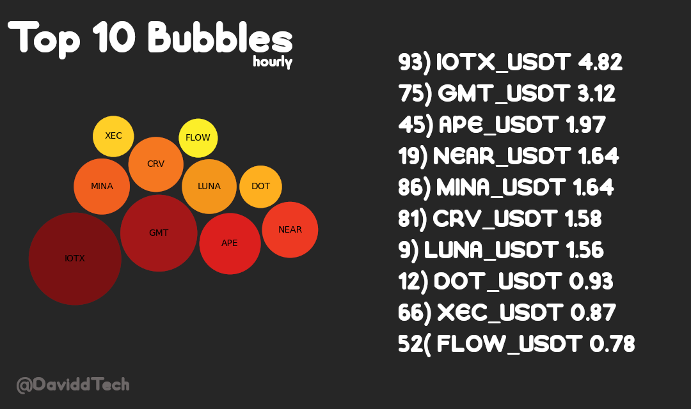

# cryptobubble-webhook

Cryptobubble-webhook is scraping Top 1000 coins from [cryptobubbles.net](cryptobubbles.net). Creates bubble image and automatically send that image to Discord Webhook.

# 📌 Example Image


# Getting Started

This is an example of how you may give instructions on setting up your project locally. To get a local copy up and running follow these simple example steps.

## Prerequisites

First of all we need install required libraries.
```sh
pip install -r requirements.txt
```

## Installation

Before to start we need set webhook url. Set your own webhook url in [main.py](https://github.com/uysalibov/cryptobubble-webhook/blob/main/main.py#L70)

```py
main.py
69     # Discord Webhook URL
70     WEBHOOK_URL = ""
```

### Installation (optional)

You can also send pictures with the Discord Bot. Clear comments and et your own Discord Bot Token and channel id in [main.py](https://github.com/uysalibov/cryptobubble-webhook/blob/main/main.py#L80).

```py
main.py
79     # You can send image using bot 
80    TOKEN = "" # Discord Bot Token
81    CHANNEL_ID = 0 # Discord Channel Id
```


# 📞 Contact
DaviddTech
+ [Patreon](https://www.patreon.com/daviddtech)
+ [YouTube](https://www.youtube.com/c/DaveASargent)
+ [Twitter](https://twitter.com/davidddottech)
+ [Instagram](https://www.instagram.com/DaviddTech/)

uysalibov
+ [Twitter](https://twitter.com/uysalibov)
+ [Mail](mailto:uysalibov@gmail.com)